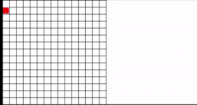

# maze-tree-traversal



Sebuah program Python yang menghasilkan labirin acak dan menyelesaikannya menggunakan algoritma BFS (Breadth-First Search) dan DFS (Depth-First Search) dengan visualisasi waktu nyata menggunakan Pygame.

## Kontributor
- [Fauzan Rafingudin](https://github.com/FauzanFR)
- [Muh. Argya Ishmat Islah Putra Mansyur]()
- [Royhan Jinan Ramadlani]()

## Fitur Utama
- **Generasi Labirin**: Membuat labirin acak menggunakan algoritma recursive backtracking.
- **Penyelesaian Labirin**:
  - Implementasi BFS (untuk mencari jalur terpendek)
  - Implementasi DFS (untuk eksplorasi mendalam)
- **Visualisasi Interaktif**:
  - Proses generasi labirin
  - Proses penyelesaian langkah demi langkah
  - Representasi pohon dari struktur labirin
- **Perbandingan Algoritma**:
  - Statistik langkah, waktu eksekusi, dan panjang jalur
  - Kesimpulan performa BFS vs DFS
- **Kontrol Pengguna**:
  - Pause/resume proses
  - Scroll visualisasi pohon

## Persyaratan
- Python 3.x
- Pygame

## Instalasi
1. Clone repositori ini:
```bash
git clone https://github.com/FauzanFR/maze-tree-traversal
cd maze-tree-traversal
```
2. Install dependensi:
```bash
pip install pygame
```

## Cara Menggunakan
Jalankan program utama:
```bash
python maze.py
```

## Kontrol
- **Scroll mouse**: Untuk melihat bagian lain dari visualisasi pohon
- **Spacebar**: Menjeda/melanjutkan proses penyelesaian
- **Tombol apa saja**: Melanjutkan ke tahap berikutnya saat dijeda
- **Close window**: Keluar dari program

## Struktur Kode
```plaintext
maze3.py
├── Class Cell: Representasi sel labirin dengan dinding-dindingnya
├── Class TreeNode: Node untuk representasi pohon
├── Fungsi generate_maze(): Generator labirin
├── Fungsi maze_to_tree(): Mengubah labirin grid menjadi TreeNode berbasis acyclic tree (perfect maze)
├── Fungsi solve_bfs(): Implementasi BFS
├── Fungsi solve_dfs(): Implementasi DFS
├── Fungsi visualisasi: draw_maze(), draw_tree(), dll.
└── Main loop: Mengatur alur program utama
```
## Penjelasan Teknis

Program ini memisahkan antara proses konstruksi labirin (`Cell`) dan proses traversal (`TreeNode`). Hal ini memungkinkan visualisasi algoritma menjadi lebih terkontrol dan modular. Struktur `Cell` cocok untuk pengelolaan dinding dan arah saat membentuk maze, sementara `TreeNode` memungkinkan proses BFS dan DFS dijalankan secara bersih dan efisien menggunakan struktur pohon yang acyclic. Hal ini juga memungkinkan penggunaan `yield` untuk menghasilkan langkah visualisasi traversal satu per satu.

## Struktur Kode
Anda dapat mengubah parameter di bagian atas file maze3.py:
```python
GEN_DELAY = 10         # Delay generasi labirin (ms)
SOLVE_DELAY = 130      # Delay solusi (ms)
ROWS_SIZE = 15         # Ukuran baris labirin
COLS_SIZE = 15         # Ukuran kolom labirin
CELL_SIZE = 30         # Ukuran pixel per sel
ENABLE_PAUSE = True    # Aktifkan fitur pause
```
## Contoh Output

## Performa
Program akan menampilkan perbandingan:

- Jumlah langkah yang diambil BFS vs DFS
- Waktu eksekusi masing-masing algoritma
- Panjang jalur solusi yang ditemukan
- Kesimpulan algoritma mana yang lebih efisien

## Kontribusi
Kontribusi dipersilakan! Buat fork repositori dan ajukan pull request

## License
This project is licensed under the MIT License — see the [LICENSE](./LICENSE) file for details.
